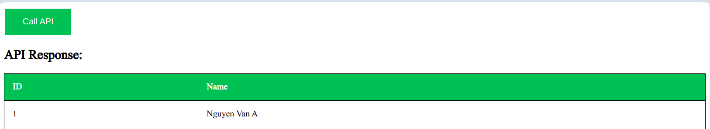

# Instructions for running this project on VSCode app

**NOTE 1:**
Replace the api link (API_URL) in the script.js file with your api link

1. Install the "Live Server" extension on VSCode\
*Skip this step if you have a Live Server extension installed*
- Open VSCode
- Go to extensions
- Search for an extension with the name Live Server
- Click the install button to install this extension

2. Run FE web
- Click the "Go Live" button on the bottom toolbar of VSCode

## Desired results
Display the same list of accounts as the api link View the list of accounts inside BE

## Case of error 
Does not display account list or display error message